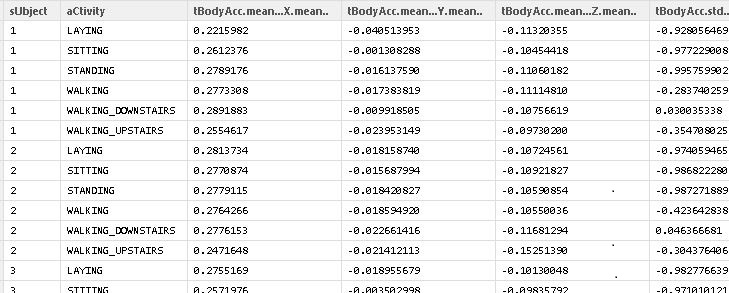

#CodeBook Getting&CleaningData Project

##Raw Data

###Source of the raw data files:

* A full description of the raw data is available at the site where the data can be obtained:  
    
    * http://archive.ics.uci.edu/ml/datasets/Human+Activity+Recognition+Using+Smartphones  

* Data to be used for the project can be sourced here:  
    
    * https://d396qusza40orc.cloudfront.net/getdata%2Fprojectfiles%2FUCI%20HAR%20Dataset.zip   

###Downloaded  - Zip File Name  
    "UCI HAR Dataset"  (ZipFile)  

##README.txt 
Provides a description of the purpose for and methods used to compile the Human Activity Recognition Using Smartphones Dataset and - - -  

* Detail infomation about what is provided in each record
* Listing of Files included in the dataset
* These key notes: 
	+ Features are normalized and bounded within [-1,1].
	+ Each feature vector is a row on the text file. 
* License information regarding the use of the raw data 

##features_info.txt 

Defines data set that is the source of raw data used for this effort. It includes the accelerometer and gyroscope 3-axial raw signals and the individual measurements, These elements are the bases for the data submitted for this project. Shows information about the variables used on the feature vector.

* The signals used to estimate variables of the feature vector for each pattern:  
* The set of variables that were estimated from these signals are:
* Additional vectors obtained by averaging the signals used on the angle() variable:

###The dataset includes the following files:  

* 'README.txt'
* 'features_info.txt': Shows information about the variables used on the feature vector.
* 'features.txt': List of all features.
* 'activity_labels.txt': Links the class labels with their activity name.
* 'train/X_train.txt': Training set.
* 'train/y_train.txt': Training labels.
* 'test/X_test.txt': Test set.
* 'test/y_test.txt': Test labels.

###The following files are available for the train and test data. 

Their descriptions are equivalent. 

* 'train/subject_train.txt': Each row identifies the subject who performed the activity for each window sample. Its range is from 1 to 30. 
* 'train/Inertial Signals/total_acc_x_train.txt': The acceleration signal from the smartphone accelerometer X axis in standard gravity units 'g'. Every row shows a 128 element vector. The same description applies for the 'total_acc_x_train.txt' and 'total_acc_z_train.txt' files for the Y and Z axis. 
* 'train/Inertial Signals/body_acc_x_train.txt': The body acceleration signal obtained by subtracting the gravity from the total acceleration. 
* 'train/Inertial Signals/body_gyro_x_train.txt': The angular velocity vector measured by the gyroscope for each window sample. The units are radians/second. 

###Notes: 

* Features are normalized and bounded within [-1,1].
* Each feature vector is a row on the text file.

##Steps to process the data:
* Identify required libraries
* Download and unzip the raw data files into the current working directory
* Read and combine the Test & Train sets of files creating 3 data sets
	* Observations data 
	* Subjects data 
	* Activities codes data
* Load acceptable column headers into a data set 
	* read features.txt data
	* modifies the listed features to be acceptable variable names (Replace "(, ), -)" characters with ".")
	* adds a ".mean.." to the variable names to identify the final results as means
	* transpose the feature list from rows to columns
	* loads the data set as column names for the combined observation data 
* Selects the observation columns matching the criteria of Mean and Standard Deviation into a new selected data set `*
* Add the Activity labels to the new data set 
	* read activities labels into a data set
	* then join the activities label data set to update the selected observation data set 
	* add aCtivity label to the new column
*  Housekeeping - remove unneeded data frames
* Add the Subjects data set to the updated selected observations data and name column to sUbject
* Groups the full data frame by sUbject and aCtivities creating a grouped data set
* Summaries each of the remaining columns of the grouped (sUbject,aCtivites)data set using the means function
* Write out the results as a txt file in the current working directory  

##Variables
* Criteria for selecting variables to include
	* Project asked to exact only the measurements of the mean and standard deviation measurements for each observations
		* The two obvious measurement types to include:
			* mean(): Mean value - 	33 entries
			* std(): Standard deviation	 - 33 entries
		* Included the angle() variables as they were defined as "vectors obtained by averaging (mean) the signals"  -  6 entries
		* Excluded the meanFreq() as they were defined as - weighted **average** of the frequency components to obtain a mean **frequency** - 13 entries
		
		
* Selected Variables
	* Mean() 33 entries  
	`*
	* tBodyAcc-mean()-X  
	* tBodyAcc-mean()-Y  
	* tBodyAcc-mean()-Z  
	* tGravityAcc-mean()-X  
	* tGravityAcc-mean()-Y  
	* tGravityAcc-mean()-Z  
	* tBodyAccJerk-mean()-X  
	* tBodyAccJerk-mean()-Y  
	* tBodyAccJerk-mean()-Z  
	* tBodyGyro-mean()-X  
	* tBodyGyro-mean()-Y  
	* tBodyGyro-mean()-Z  
	* tBodyGyroJerk-mean()-X  
	* tBodyGyroJerk-mean()-Y  
	* tBodyGyroJerk-mean()-Z  
	* tBodyAccMag-mean()  
	* tGravityAccMag-mean()  
	* tBodyAccJerkMag-mean()  
	* tBodyGyroMag-mean()  
	* tBodyGyroJerkMag-mean()  
	* fBodyAcc-mean()-X  
	* fBodyAcc-mean()-Y  
	* fBodyAcc-mean()-Z  
	* fBodyAccJerk-mean()-X  
	* fBodyAccJerk-mean()-Y  
	* fBodyAccJerk-mean()-Z  
	* fBodyGyro-mean()-X  
	* fBodyGyro-mean()-Y  
	* fBodyGyro-mean()-Z  
	* fBodyAccMag-mean()  
	* fBodyBodyAccJerkMag-mean()  
	* fBodyBodyGyroMag-mean()  
	* fBodyBodyGyroJerkMag-mean()
	* 
	
  
	* Std() 33 entries  
	* tBodyAcc-std()-X  
	* tBodyAcc-std()-Y  
	* tBodyAcc-std()-Z  
	* tGravityAcc-std()-X  
	* tGravityAcc-std()-Y  
	* tGravityAcc-std()-Z  
	* tBodyAccJerk-std()-X  
	* tBodyAccJerk-std()-Y  
	* tBodyAccJerk-std()-Z  
	* tBodyGyro-std()-X  
	* tBodyGyro-std()-Y  
	* tBodyGyro-std()-Z  
	* tBodyGyroJerk-std()-X  
	* tBodyGyroJerk-std()-Y  
	* tBodyGyroJerk-std()-Z  
	* tBodyAccMag-std()  
	* tGravityAccMag-std()  
	* tBodyAccJerkMag-std()  
	* tBodyGyroMag-std()  
	* tBodyGyroJerkMag-std()  
	* fBodyAcc-std()-X  
	* fBodyAcc-std()-Y  
	* fBodyAcc-std()-Z  
	* fBodyAccJerk-std()-X  
	* fBodyAccJerk-std()-Y  
	* fBodyAccJerk-std()-Z  
	* fBodyGyro-std()-X  
	* fBodyGyro-std()-Y  
	* fBodyGyro-std()-Z  
	* fBodyAccMag-std()  
	* fBodyBodyAccJerkMag-std()  
	* fBodyBodyGyroMag-std()  
	* fBodyBodyGyroJerkMag-std()
	*   
  
	* Mean) 6 entries  
	* angle(tBodyAccJerkMean),gravityMean)  
	* angle(tBodyGyroMean,gravityMean)  
	* angle(tBodyGyroJerkMean,gravityMean)  
	* angle(X,gravityMean)  
	* angle(Y,gravityMean)  
	* angle(Z,gravityMean)  
  
  
* Variables NOT selected: 

	* MeanFreq 13 entries 
	`* 
	* fBodyAcc-meanFreq()-X  
	*  fBodyAcc-meanFreq()-Y  
	* fBodyAcc-meanFreq()-Z  
	* fBodyAccJerk-meanFreq()-X  
	* fBodyAccJerk-meanFreq()-Y  
	* fBodyAccJerk-meanFreq()-Z  
	* fBodyGyro-meanFreq()-X  
	* fBodyGyro-meanFreq()-Y  
	* fBodyGyro-meanFreq()-Z  
	* fBodyAccMag-meanFreq()  
	* fBodyBodyAccJerkMag-meanFreq()  
	* fBodyBodyGyroMag-meanFreq()  
	* fBodyBodyGyroJerkMag-meanFreq()  

* Acceptable variable names
	* e.g.  tBodyAcc-mean()-X   would be changed to  tBodyAcc.mean...X.mean..  
	*  Minus and parenthesise cannot be used in many functions and therefore need to be replaced
	*  mean.. has been added to all variable names to match the resultant column information types
	*  All variable names have been changed as outlined above

##Results
Were written out to the file SmartPhoneDataBySubAct.txt  

File contains the means for the selected 72 variables group by subject and activity.

